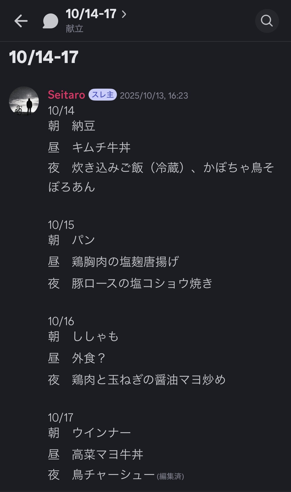
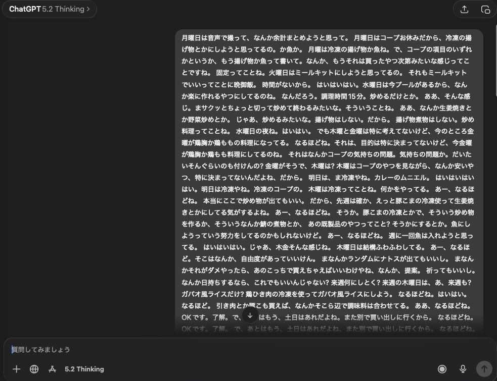
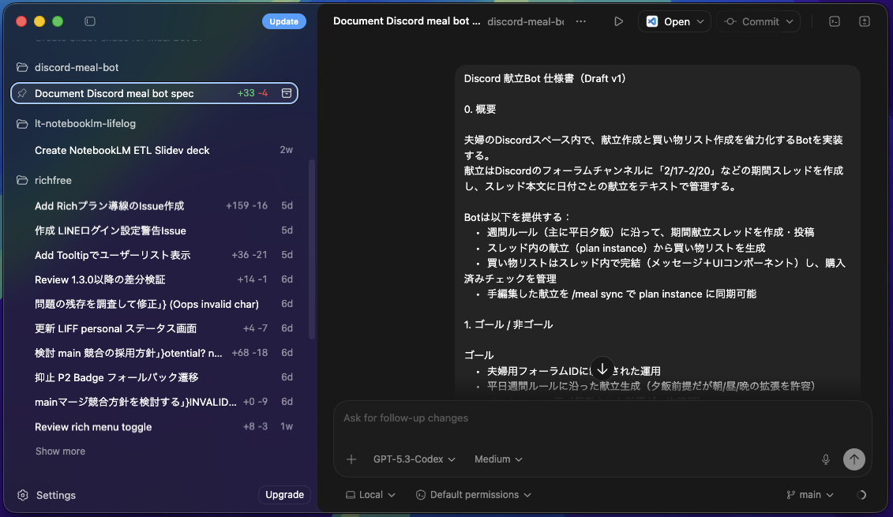

## 「今週なに食べる？」を AIで終わらせた話

2026-02-27

「俺たちのAI活用LT」 / Tahara Seitaro

<!--
0:00-0:15

今日は「今週なに食べる？」をAIで終わらせた話をします。

すごく大きな話ではなくて、
家庭内で毎週発生する、地味だけど確実に面倒なタスクを、
AIとBotでどう片付けたか、という話です。
-->

---
layout: two-cols
class: profile
---

## 自己紹介

### Tahara Seitaro

- Software Engineer
- 普段はWebアプリケーション開発
- 子育て奮闘中
- 悩み「可処分時間が足りない」

::right::

{width=250px lazy}

.

<!--
0:15-0:30

改めまして、Tahara Seitaroです。
普段はWebアプリケーションを開発していて、子育て中です。

最近ずっと感じている悩みが、
「やりたいことは多いのに、可処分時間が足りない」ことです。

なので今日のLTは、
その限られた時間をどうやって取り戻そうとしているのか、という話でもあります。
-->

---
layout: section
class: pain
---

# pain

日々の献立を考えるのが面倒

<!--
0:30-0:45

まず課題です。

日々の献立を考えるのが、とにかく面倒です。
しかも献立を決めたら終わりではなくて、
次に買い物リストも作らないといけない。

この「毎週発生する小さな意思決定」が、
じわじわ時間と気力を削ってくるんですよね。
-->

---
layout: two-cols
---

## 我が家の献立運用

Discordで週2回Threadを立てる

{width=250px lazy}

::right::

平日はコープ・休日はスーパーで買い出し

<!--
0:45-1:10

我が家では、献立は週2回まとめて考えています。

平日はコープ、休日はスーパーで買い出し、という運用なので、
その頻度に合わせて数日分ずつ決める形です。

夫婦のやり取りは基本Discordなので、
献立も毎回スレッドを立てて決めていました。

面倒なのは、その中身を毎回人力で考えることでした。
-->

---
layout: default
class: ideation
---

## 作りたいものをイメージする

<v-clicks>

- Discord Botに「献立考えて」コマンドを送る
- Botが数日分の献立を考えてくれる
- Botに「献立から買い物リスト作って」コマンドを送る
- Botがリストを作ってくれる・Discordから消し込みできる

</v-clicks>

<!--
1:10-1:35

そこで作りたかったのが、この流れです。

[click]Discordで「献立考えて」と送ると、
[click]数日分の献立が返ってくる。
[click]さらに「買い物リスト作って」と送ると、
[click]必要な食材がまとまって、Discord上で消し込みまでできる。

ポイントは、単にレシピを出すことではなくて、
今の家庭内の運用にそのまま乗ることです。
-->

---

## Userの声を聞く

<v-clicks>

### User = 私 + 妻

雑談を

**ChatGPTで文字起こし**

{width=250px lazy}

↓

{width=250px lazy}

### まずは困りごとを言語化

{width=250px lazy}

### いきなり作らない

思い込みで作ると、  
誰も使わないものができる

</v-clicks>

<!--
1:35-2:05

ただ、ここでいきなり作り始めないようにしました。

[click]ユーザーは、私と妻です。
なのでまず、普段どうやって献立を決めているかを雑談して、
それをChatGPTアプリで文字起こししました。

[click]
やってみると、
「月曜はこうしたい」とか
「水曜は時間がない」とか、
頭の中にあるルールがかなり出てきます。

[click]
思い込みで作ると、動くけど使われないものができる。
なので先に、困りごとを言語化しました。
-->

---
class: ai-dialogue
---

## AIと壁打ち

<v-clicks>

> OpenRouter の無料APIを使い、discordの実用的なAIチャットボットを作ることはできる？

> 夫婦のdiscord スペースだけで使える献立botを作ろうと思う。
> サーバーコストをかけず、cloudflare workersでホストしたい。

> Slash Commandの設計をしたい。
> 献立は献立用のForumに「2/1-2/4」など数日単位でスレッドを作り、以下のような形で管理している。
> ...

> 実装はCodexにさせる予定。仕様書のMarkdownを作成したいが、検討しておくべき事項は残っている？

</v-clicks>

<!--
2:05-2:35

文字起こしした内容をもとに、今度はAIと壁打ちします。

[click]無料APIでいけるか、
[click]Cloudflare Workersで足りるか、
[click]Slash Commandはどう切るか、
Forumのスレッド運用とどう合わせるか。

[click]
このあたりを順番に詰めていくと、
ただの思いつきが、実装可能な仕様に変わっていきます。
-->

---
layout: two-cols
---

## いざ実装

構成は

- Discord Bot（UI）
- Cloudflare Worker（Bot処理）
- D1（データ永続化）
- OpenRouter（LLM）
- GitHub Actions（デプロイ）

::right::

{width=600px lazy}

<!--
2:35-3:00

実装はかなりシンプルです。

Discord BotがUIで、
Cloudflare Workerで処理して、
D1に状態を持たせて、
LLMはOpenRouter経由で無料のモデルを使う。
デプロイはGitHub Actionsです。

ChatGPT Plusを契約しているので、macのCodexアプリから指示を出しています。
-->

---
layout: quote
---

# ( っ'-')╮ =͟͟͞͞📝ﾌﾞｫﾝ

Hey AI, これ作って！

<!--
3:00-3:15

やったことを雑に言うと、
markdownの仕様書をAIに投げて「これ作って」と言っただけです。

もちろん細かい修正はあります。
でも体感としては、
実装よりも、実装前の整理のほうが長かったです。

逆に言うと、そこができれば作るハードルはかなり低いです。
-->

---
layout: section
---

## 動いた！

<BotCrossfade />

<!--
3:15-3:45

ということで、[click]ひとまず動くものができました。

[click]Discord上で献立を出して、
[click]必要なら買い物リストまで出せるところまで来ています。

[click]まだ作って間もないので、
「家庭の運用に完全に乗った」とまでは言えません。
ただ、少なくとも
毎回ゼロから考える面倒を減らせそうだ、という感触はあります。

AIっぽい派手さというより、
生活の中の小さな手間を減らす道具として形にできたのが良かったです。
-->

---
layout: section
class: learnings
---

## 学び

<v-clicks>

1. 勝負どころは実装前（要件化）
2. オリジナルの制約に価値が宿る
3. 完成より定着（使われるUX）

</v-clicks>

<!--
3:45-4:25

やってみて学びは3つありました。

[click]1つ目は、勝負どころは実装前だということです。
いきなりコードを書かせるより、
要件を言語化したほうが、欲しいものに近づきやすい。

[click]2つ目は、オリジナルの制約に価値があることです。
たとえば
「月曜は魚」とか
「水曜は調理時間15分以内」みたいな生活の制約を入れた瞬間に、
既製品にはない、独自性やかゆいところに手が届く「ちょうど良さ」が生まれます。

[click]3つ目は、完成より運用設計です。
動くBotが簡単に作れても、家族の導線に自然に乗らないと使われません。
なので本当の勝負は、ここからどう馴染ませるか、もっとより良く改善してゆけるかだと思っています。
-->

---
layout: quote
---

# Keep building.

Enjoy coding, happy hacking.

<!--
4:25-5:00

AIのおかげで、
こういう「自分の生活にちょうど合う小さな道具」を作るハードルはかなり下がりました。

大きなサービスを作る話ではなくても、
毎週発生する面倒ごとに対して、
まず動くものを作って試せるだけでも価値があると思っています。

今回のBotも、完成して終わりではなくて、
ここから実際の生活の中で磨いていく段階です。

既製品では微妙に埋まらない課題を、
AIで素早く形にできる。
そこが一番おもしろいところだと思っています。

ありがとうございました。
-->
